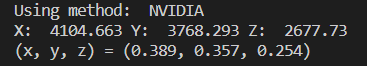
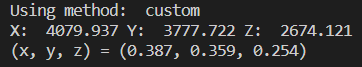

# Spectral Data to CIE XYZ Converter

Convert spectral radiometric data to the XYZ tristimulus values.

## Description

The XYZ tristimulus values are computed by:
$$X=\int_0^{\infty} {L(\lambda)\overline{x}(\lambda)} \, {\rm d}\lambda$$
$$Y=\int_0^{\infty} {L(\lambda)\overline{y}(\lambda)} \, {\rm d}\lambda$$
$$Z=\int_0^{\infty} {L(\lambda)\overline{z}(\lambda)} \, {\rm d}\lambda$$
where $L(\lambda)$ is the spectral radiometric value of a primary light source, and $\overline{x}(\lambda), \overline{y}(\lambda), \overline{z}(\lambda)$ are the CIE 1931 color matching functions.
In this program, I included two approximations to the color matching functions. One is provided by [Waveform lighting](https://www.waveformlighting.com/tech/color-matching-function-x-y-z-values-by-wavelength-csv-excel-format) and the other is from [NVIDIA research](https://jcgt.org/published/0002/02/01/paper.pdf), which uses a multi-lobe Guassian fit.

## How to run the program

```
python3 CIExy.py -d <your spectral data> -xyz <your custom color matching functions> -m <method>
```

The default method uses NVIDIA approximation. Please change the method to `custom` if you want to use other color matching functions. The default custom functions are provided by waveform lighting.

## Results & Statistics

We measured the spectral irradiance of an Mini-LED panel using a OHSP-350 colorimeter facing perpendicular to the emission surface.




## Acknowledgments

References.

- [Gigahertz-Optik](https://www.gigahertz-optik.com/en-us/service-and-support/knowledge-base/basics-light-measurement/light-color/colorimetry/)
- [Yuhao Zhu](http://yuhaozhu.com/blog/cmf.html)
- [NVIDIA Research](https://research.nvidia.com/publication/2013-07_simple-analytic-approximations-cie-xyz-color-matching-functions)
- [Waveform lighting](https://www.waveformlighting.com/tech/color-matching-function-x-y-z-values-by-wavelength-csv-excel-format)
- [Scratchapixel](https://www.scratchapixel.com/lessons/digital-imaging/colors/color-space)
- [Chandler Abraham](https://medium.com/hipster-color-science/a-beginners-guide-to-colorimetry-401f1830b65a)
- [Wikipedia](https://en.wikipedia.org/wiki/CIE_1931_color_space)
